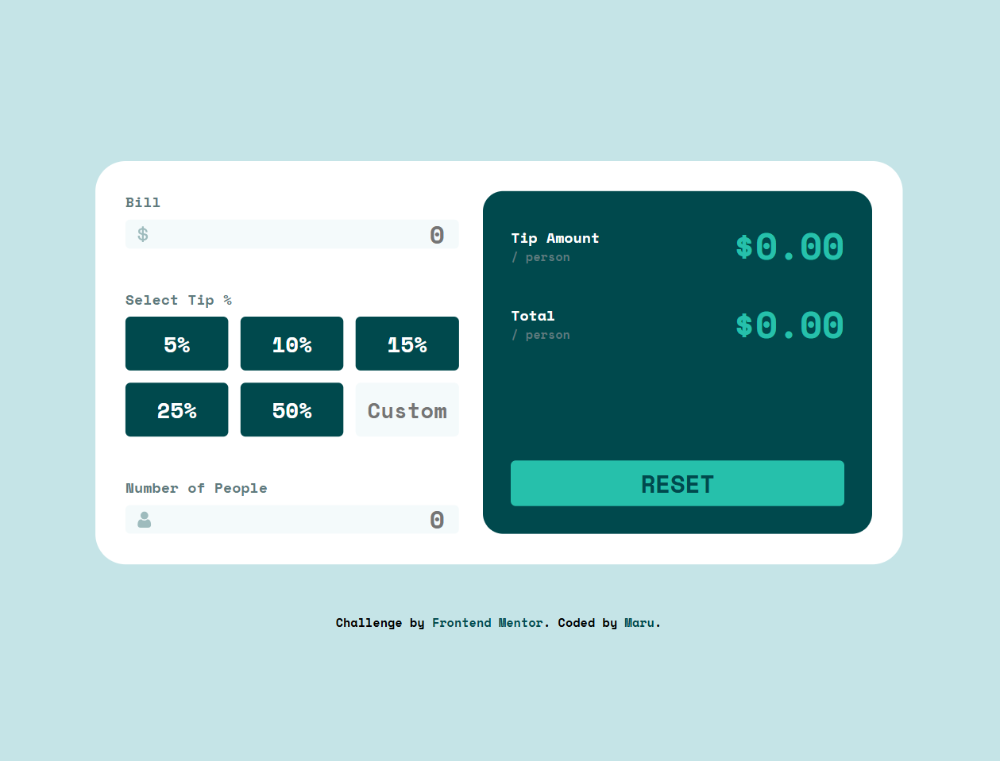
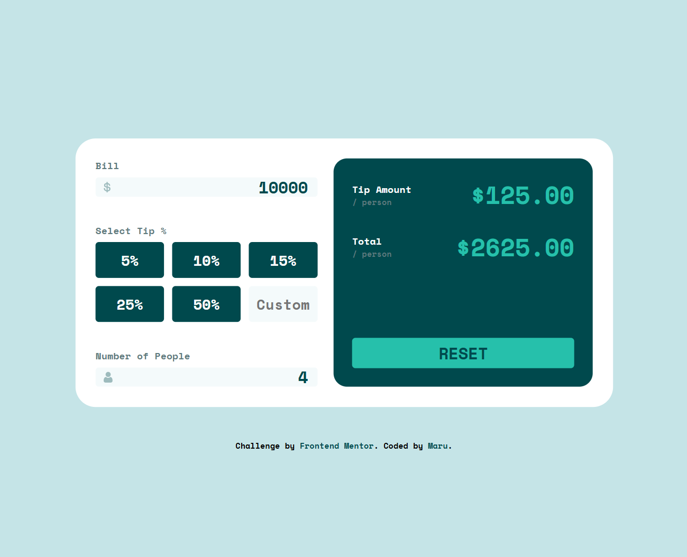
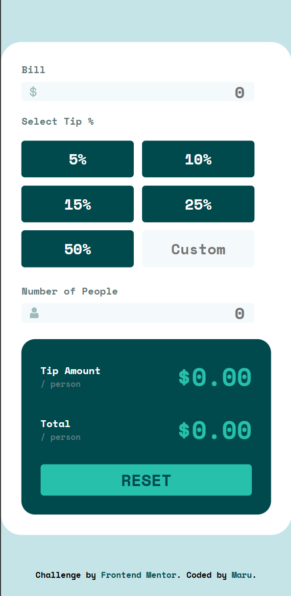

# Frontend Mentor - Tip calculator app


This is a solution to the [Tip calculator app challenge on Frontend Mentor](https://www.frontendmentor.io/challenges/tip-calculator-app-ugJNGbJUX). Frontend Mentor challenges help you improve your coding skills by building realistic projects.

## Table of contents

- [Overview](#overview)
  - [The challenge](#the-challenge)
  - [Screenshot](#screenshot)
  - [Links](#links)
- [My process](#my-process)
  - [Built with](#built-with)
  - [What I learned](#what-i-learned)
  - [Continued development](#continued-development)
- [Author](#author)

## Overview

### The challenge

Users should be able to:

- View the optimal layout for the app depending on their device's screen size
- See hover states for all interactive elements on the page
- Calculate the correct tip and total cost of the bill per person

### Screenshot







### Links

- Solution URL: [Add solution URL here](https://www.frontendmentor.io/solutions/tip-calculator-gM3JiNDaqh)
- Live Site URL: [Add live site URL here](https://tip-calculator-zeta-one.vercel.app/)

## My process

### Built with

- HTML5 markup
- CSS
- Flexbox
- CSS Grid
- JavaScript

### What I learned

During this project, I learned how to:

- Use JavaScript to handle real-time user inputs and update the UI dynamically.
- Structure functions by separating concerns (e.g., error checking, calculation, and display update).
- Return and destructure objects from functions to manage multiple values efficiently.
- Properly use e.target in event listeners to capture the clicked button and extract its value.
- Implement basic error handling (e.g., preventing calculations when the number of people is zero).

```javascript
const checkError = () => {
  if (peopleValue === 0) {
    peopleLabel.classList.add("error");
    peopleInput.classList.add("error");
    return true;
  } else {
    peopleLabel.classList.remove("error");
    peopleInput.classList.remove("error");
    return false;
  }
};

const calculateAmounts = () => {
  const tipAmount = (billValue * tipValue) / peopleValue;
  const totalAmount = (billValue + billValue * tipValue) / peopleValue;
  return { tipAmount, totalAmount };
};

const updateDisplay = (tipAmount, totalAmount) => {
  tipAmountDisplay.textContent = `$${tipAmount.toFixed(2)}`;
  totalAmountDisplay.textContent = `$${totalAmount.toFixed(2)}`;
};

const calculateTip = () => {
  if (checkError()) {
    updateDisplay(0, 0);
    return;
  }

  const { tipAmount, totalAmount } = calculateAmounts();
  updateDisplay(tipAmount, totalAmount);
};
```

### Continued development

- Enhancing the UI/UX with animations or smoother error messaging.
- Toggle between light and dark themes

## Author

- Frontend Mentor - [@zerowater](https://www.frontendmentor.io/profile/zerowater4704)
- Twitter - [@jnyngxi188584](https://www.x.com/jnyngxi188584)
